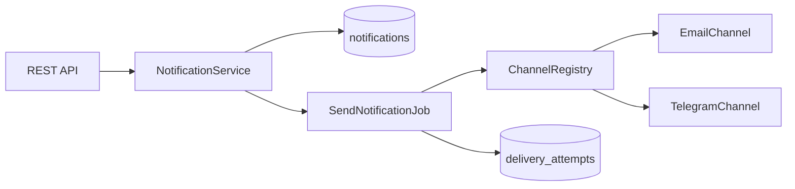

# Notification Service

Небольшой сервис уведомлений на Laravel: REST API, асинхронная доставка с повторными попытками, расширяемые каналы (email, telegram) и генерация отчётов.

## Быстрый старт (Docker)

```bash
cp .env.example .env   # если файла .env ещё нет
docker compose up --build
```

При первом запуске сгенерируйте ключ шифрования (если `APP_KEY` в `.env` пустой):

```bash
php artisan key:generate
```

> Не оставляйте `APP_KEY=` пустым — Docker Compose читает `.env` и передаёт пустое значение в контейнер, из-за чего Laravel падает с `MissingAppKeyException`.

После запуска API доступен по адресу `http://localhost:8000`.

> **Важно:** в `.env` должны быть заполнены `APP_KEY=base64:...` и `DB_HOST=postgres` для запуска через Docker. Не оставляйте `APP_KEY=` пустым. Для локального `php artisan serve` на Windows замените `DB_HOST` на `127.0.0.1` и запустите `docker compose up -d postgres`.

Полезные команды:

```bash
# Тесты (в контейнере доступны PDO-расширения для SQLite)
docker compose run --rm app php artisan test

# Статический анализ
docker compose run --rm app vendor/bin/phpstan analyse --memory-limit=512M

# Code style
docker compose run --rm app vendor/bin/pint
```

## Локальный запуск без Docker

Требования: PHP 8.3+, Composer, PostgreSQL 16+, Node.js (опционально для фронтенда).

```bash
cp .env.example .env
composer install
php artisan key:generate
php artisan migrate
php artisan serve
```

В отдельном терминале запустите воркер очереди:

```bash
php artisan queue:work --tries=3 --backoff=5,15,30
```

## API

### Уведомления

| Метод | Endpoint | Описание |
|-------|----------|----------|
| `POST` | `/api/notifications` | Создать уведомление |
| `GET` | `/api/notifications/{id}` | Получить статус |
| `GET` | `/api/users/{userId}/notifications` | История с фильтрами `status`, `channel` |

Пример создания:

```bash
curl -X POST http://localhost:8000/api/notifications \
  -H "Content-Type: application/json" \
  -d '{"user_id":1,"channel":"email","message":"Hello"}'
```

### Отчёты

| Метод | Endpoint | Описание |
|-------|----------|----------|
| `POST` | `/api/users/{userId}/reports` | Запросить генерацию за период |
| `GET` | `/api/reports/{id}` | Статус генерации |
| `GET` | `/api/reports/{id}/download` | Скачать готовый JSON-файл |

## Архитектурные решения

### Расширяемые каналы (Open/Closed)

Каждый канал реализует `NotificationChannelInterface` и регистрируется в `config/notifications.php`. `ChannelRegistry` резолвит реализацию по enum-значению.

Чтобы добавить SMS:

1. Создать `SmsChannel implements NotificationChannelInterface`
2. Добавить case в `NotificationChannel`
3. Зарегистрировать класс в `config/notifications.php`

Существующие job'ы, сервисы и контроллеры менять не нужно.



### Гарантия доставки

1. При создании уведомление получает статус `processing`, в очередь ставится `SendNotificationJob`.
2. Job вызывает канал и записывает каждую попытку в `notification_delivery_attempts`.
3. При ошибке job бросает исключение — Laravel повторяет задачу (`tries=3`, `backoff: 5/15/30 сек`).
4. После исчерпания попыток срабатывает `failed()` и статус меняется на `error`.
5. При успехе статус становится `sent`.

Так система понимает, что доставка не удалась (записи попыток + исключение в job), и автоматически ретраит без потери сообщения.

### Отчёты

Генерация асинхронная (`GenerateNotificationReportJob`). Файл сохраняется в `storage/app/private/reports/`. Если генерация падает:

- частичный файл удаляется;
- статус отчёта — `failed`;
- сохраняется `error_message`.

Повторный запрос создаёт новый отчёт.

### Валидация

Все входящие данные проходят через FormRequest-классы.

## Тестирование и качество кода

```bash
composer test      # PHPUnit (unit + feature)
composer phpstan   # PHPStan level 5 (Larastan)
composer pint      # Laravel Pint
composer check     # pint + phpstan + test
```

## Что бы я улучшил для продакшена

- OAuth2/API tokens, проверка доступа к чужим `user_id`
- Метрики доставки

## Лицензия

MIT
