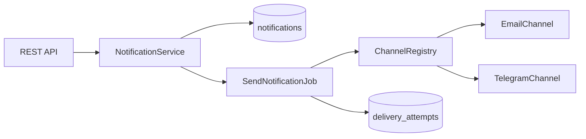

# Notification Service

Небольшой сервис уведомлений на Laravel: REST API, асинхронная доставка с повторными попытками, расширяемые каналы (email, telegram) и генерация отчётов.

## Быстрый старт (Docker)

```bash
cp .env.example .env   # если файла .env ещё нет
docker compose up --build
```

При первом запуске сгенерируйте ключ шифрования (если `APP_KEY` в `.env` пустой):

```bash
php artisan key:generate
```

> Не оставляйте `APP_KEY=` пустым — Docker Compose читает `.env` и передаёт пустое значение в контейнер, из-за чего Laravel падает с `MissingAppKeyException`.

После запуска API доступен по адресу `http://localhost:8000`.

> **Важно:** в `.env` должны быть заполнены `APP_KEY=base64:...` и `DB_HOST=postgres` для запуска через Docker. Не оставляйте `APP_KEY=` пустым. Для локального `php artisan serve` на Windows замените `DB_HOST` на `127.0.0.1` и запустите `docker compose up -d postgres`.

Полезные команды:

```bash
# Тесты (в контейнере доступны PDO-расширения для SQLite)
docker compose run --rm app php artisan test

# Статический анализ
docker compose run --rm app vendor/bin/phpstan analyse --memory-limit=512M

# Code style
docker compose run --rm app vendor/bin/pint
```

## Локальный запуск без Docker

Требования: PHP 8.3+, Composer, PostgreSQL 16+, Node.js (опционально для фронтенда).

```bash
cp .env.example .env
composer install
php artisan key:generate
php artisan migrate
php artisan serve
```

В отдельном терминале запустите воркер очереди:

```bash
php artisan queue:work --tries=3 --backoff=5,15,30
```

## API

### Уведомления

| Метод | Endpoint | Описание |
|-------|----------|----------|
| `POST` | `/api/notifications` | Создать уведомление |
| `GET` | `/api/notifications/{id}` | Получить статус |
| `GET` | `/api/users/{userId}/notifications` | История с фильтрами `status`, `channel` |

Пример создания:

- **Метод:** `POST`
- **URL:** `http://localhost:8000/api/notifications`
- **Тело запроса (JSON):**

```json
{
  "user_id": 1,
  "channel": "email",
  "message": "Hello"
}
```

#### История уведомлений пользователя

`GET /api/users/{userId}/notifications` — список уведомлений с пагинацией и необязательными фильтрами.

**Query-параметры:**

| Параметр | Обязательный | Значения | Описание |
|----------|--------------|----------|----------|
| `status` | нет | `processing`, `sent`, `error` | Фильтр по статусу |
| `channel` | нет | `email`, `telegram` | Фильтр по каналу |
| `per_page` | нет | `1`–`100` (по умолчанию `15`) | Количество записей на странице |
| `page` | нет | `1`, `2`, … | Номер страницы |

**Примеры URL** (можно открыть в браузере или Postman):

| Запрос | URL |
|--------|-----|
| Вся история пользователя `1` | http://localhost:8000/api/users/1/notifications |
| Только отправленные | http://localhost:8000/api/users/1/notifications?status=sent |
| Только канал email | http://localhost:8000/api/users/1/notifications?channel=email |
| Отправленные email-уведомления | http://localhost:8000/api/users/1/notifications?status=sent&channel=email |
| С ошибкой доставки | http://localhost:8000/api/users/1/notifications?status=error |
| Telegram-уведомления | http://localhost:8000/api/users/1/notifications?channel=telegram |
| Пагинация: 10 записей, страница 1 | http://localhost:8000/api/users/1/notifications?per_page=10&page=1 |

**Пример ответа:**

```json
{
  "data": [
    {
      "id": 14,
      "user_id": 1,
      "channel": "email",
      "message": "Hello",
      "status": "sent",
      "created_at": "2026-06-12T05:50:58+00:00",
      "updated_at": "2026-06-12T05:50:59+00:00"
    }
  ],
  "links": {
    "first": "http://localhost:8000/api/users/1/notifications?page=1",
    "last": "http://localhost:8000/api/users/1/notifications?page=1",
    "prev": null,
    "next": null
  },
  "meta": {
    "current_page": 1,
    "per_page": 15,
    "total": 1
  }
}
```

### Отчёты

| Метод | Endpoint | Описание |
|-------|----------|----------|
| `POST` | `/api/users/{userId}/reports` | Запросить генерацию за период |
| `GET` | `/api/reports/{id}` | Статус генерации |
| `GET` | `/api/reports/{id}/download` | Скачать готовый JSON-файл |

#### Запрос генерации отчёта

`POST /api/users/{userId}/reports` — ставит задачу на формирование отчёта за указанный период. Ответ `202 Accepted`.

**Параметры тела запроса (JSON):**

| Параметр | Обязательный | Формат | Описание |
|----------|--------------|--------|----------|
| `period_from` | да | дата/время | Начало периода |
| `period_to` | да | дата/время | Конец периода (не раньше `period_from`) |

**Примеры запросов:**

| Запрос | Метод | URL | Тело запроса (JSON) |
|--------|-------|-----|---------------------|
| Отчёт за июнь 2026 для пользователя `1` | `POST` | http://localhost:8000/api/users/1/reports | `{"period_from":"2026-06-01T00:00:00Z","period_to":"2026-06-30T23:59:59Z"}` |
| Отчёт за последнюю неделю | `POST` | http://localhost:8000/api/users/1/reports | `{"period_from":"2026-06-01T00:00:00Z","period_to":"2026-06-07T23:59:59Z"}` |
| Отчёт для пользователя `5` | `POST` | http://localhost:8000/api/users/5/reports | `{"period_from":"2026-01-01T00:00:00Z","period_to":"2026-12-31T23:59:59Z"}` |

**Пример ответа при создании (`202 Accepted`):**

```json
{
  "data": {
    "id": 3,
    "user_id": 1,
    "status": "completed",
    "period_from": "2026-06-01T00:00:00Z",
    "period_to": "2026-06-30T23:59:59Z",
    "file_path": "reports/user-1/report-3.json",
    "error_message": null,
    "created_at": "2026-06-12T06:00:00+00:00",
    "updated_at": "2026-06-12T06:00:01+00:00"
  }
}
```

> При работе через очередь (`QUEUE_CONNECTION=database`) статус сразу может быть `pending` или `processing`. Проверяйте готовность через `GET /api/reports/{id}`.

**Возможные статусы отчёта:** `pending`, `processing`, `completed`, `failed`

#### Просмотр статуса и скачивание

`GET /api/reports/{id}` и `GET /api/reports/{id}/download` — проверка готовности и загрузка файла.

**Примеры URL** (можно открыть в браузере или Postman):

| Запрос | URL |
|--------|-----|
| Статус отчёта с `id=1` | http://localhost:8000/api/reports/1 |
| Статус отчёта с `id=3` | http://localhost:8000/api/reports/3 |
| Скачать готовый отчёт `id=1` | http://localhost:8000/api/reports/1/download |
| Скачать готовый отчёт `id=3` | http://localhost:8000/api/reports/3/download |

**Пример ответа статуса (`GET /api/reports/1`):**

```json
{
  "data": {
    "id": 1,
    "user_id": 1,
    "status": "completed",
    "period_from": "2026-06-01T00:00:00Z",
    "period_to": "2026-06-30T23:59:59Z",
    "file_path": "reports/user-1/report-1.json",
    "error_message": null,
    "created_at": "2026-06-12T06:00:00+00:00",
    "updated_at": "2026-06-12T06:00:01+00:00"
  }
}
```

**Пример содержимого скачанного файла (`GET /api/reports/1/download`):**

```json
{
  "user_id": 1,
  "period": {
    "from": "2026-06-01T00:00:00+00:00",
    "to": "2026-06-30T23:59:59+00:00"
  },
  "channels": {
    "email": {
      "total": 2,
      "errors": 1
    },
    "telegram": {
      "total": 1,
      "errors": 0
    }
  },
  "generated_at": "2026-06-12T06:00:01+00:00"
}
```

> Если отчёт ещё не готов, `GET /api/reports/{id}/download` вернёт `409` с текущим статусом (`pending`, `processing` или `failed`).

**Типичный сценарий:**

1. `POST http://localhost:8000/api/users/1/reports` — запросить генерацию, получить `id` из ответа
2. `GET http://localhost:8000/api/reports/{id}` — дождаться статуса `completed`
3. `GET http://localhost:8000/api/reports/{id}/download` — скачать JSON-файл

## Архитектурные решения

### Расширяемые каналы (Open/Closed)

Каждый канал реализует `NotificationChannelInterface` и регистрируется в `config/notifications.php`. `ChannelRegistry` резолвит реализацию по enum-значению.

Чтобы добавить SMS:

1. Создать `SmsChannel implements NotificationChannelInterface`
2. Добавить case в `NotificationChannel`
3. Зарегистрировать класс в `config/notifications.php`

Существующие job'ы, сервисы и контроллеры менять не нужно.



### Гарантия доставки

1. При создании уведомление получает статус `processing`, в очередь ставится `SendNotificationJob`.
2. Job вызывает канал и записывает каждую попытку в `notification_delivery_attempts`.
3. При ошибке job бросает исключение — Laravel повторяет задачу (`tries=3`, `backoff: 5/15/30 сек`).
4. После исчерпания попыток срабатывает `failed()` и статус меняется на `error`.
5. При успехе статус становится `sent`.

Так система понимает, что доставка не удалась (записи попыток + исключение в job), и автоматически ретраит без потери сообщения.

### Отчёты

Генерация асинхронная (`GenerateNotificationReportJob`). Файл сохраняется в `storage/app/private/reports/`. Если генерация падает:

- частичный файл удаляется;
- статус отчёта — `failed`;
- сохраняется `error_message`.

Повторный запрос создаёт новый отчёт.

### Валидация

Все входящие данные проходят через FormRequest-классы.

## Тестирование и качество кода

```bash
composer test      # PHPUnit (unit + feature)
composer phpstan   # PHPStan level 5 (Larastan)
composer pint      # Laravel Pint
composer check     # pint + phpstan + test
```

## Что бы я улучшил для продакшена

- OAuth2/API tokens, проверка доступа к чужим `user_id`
- Расширить отчеты
- Добавил бы пользовательский интерфейс, что ыб не только через API можно было смотреть

## Лицензия

MIT
